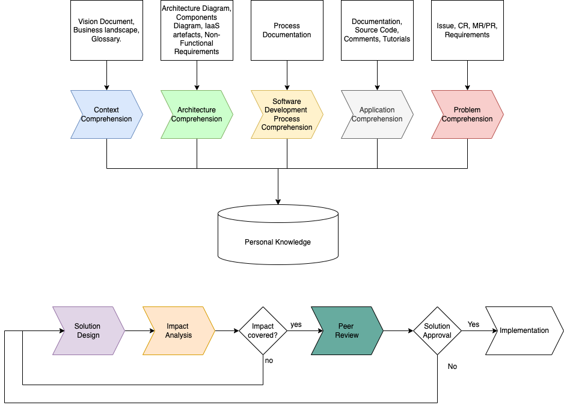
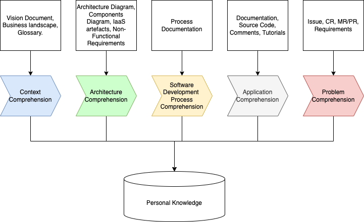
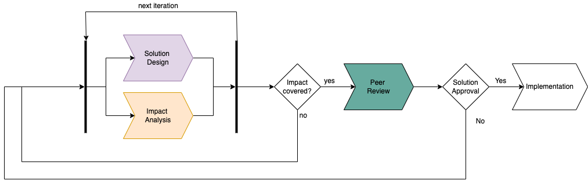

# Pyara - Exploring Knowledge and Planning of Changes (EKPC)

## Introduction
This document intends to propose the **Exploring Knowledge and Planning of Changes** (EKPC). It is a method to perform planning of changes in software maintenance. This method is a component of the **Pyara Framework**, which intends to improve the software maintenance process.

## Context
Software maintenance is a very important stage in the Software Development Lifecycle. After delivered, software needs to change, evolving to keep useful for its users. These changes may come as corrections or enhancements. Some examples of changes are:

- Bugs corrections.
- Performance improvement changes.
- Adaptations for different platforms.
- Changes to prevent security issues.
- New features.
- Features modifications to meet some new requirements.

According to literature, it is common to observe architectural degradation and technical obsolescence after many modifications [1, 2]. This may be caused by:

- **Evolution**: New requirements (or bug fixing) may demand for some architectural review, but due the time pressure, they are solved via some small, localized changes, or workarounds [3, 4, 5].
- **Turnover**: Since most of knowledge about the system are in people minds, when they leave the company, this knowledge go with them. If this knowledge is not shared and stored properly, it is lost, and it is very expensive to be retrieved later [4, 6].
- **Lack of documentation**: Software documentation is considered important to give context and help the developers to understand "what" and "how" to do [7, 11, 12].  Popularly known as outdated, inconsistent, incomplete, or even inexistent [7, 8, 9, 10]. Moreover, Agile methodologies prioritize software delivered over documentation. This does not mean that documentation should not be produced, but sometimes there is no this understanding and the documentation is purposely skipped [8, 10].  
- **Dependencies**: It is very likely that a software relies in libraries and frameworks to avoid rework and take advantage of the latest and widely used components in the market. Programming languages and frameworks may stop to be maintained and receive updates, turning impractical major improvements. This can make the software become locked in outdated components, which work differently than the latest releases. At the end of the day, the developers need to understand how those outdated components work [1, 12].

After years of changes, one or more of these factors contribute to have a software **complex**, **risky and  hard to modify**. If this software is somehow **vital for the business operations** (_what happens if the software crashes? Does the company stops or the are the operations affected?_), and/or it **contains relevant business knowledge** built in its codebase (_What if the system is deleted or become unavailable? Are there all business rules documented in somewhere in the company?_), then it may be considered a legacy software [1, 2, 4, 5, 7, 13, 14, 15, 16, 17, 18, 19, 20].  

### Why all these things matter?

In any change request, the developer assigned need to understand the software, plan the changes and evaluate the impact (even only in her/his mind), to only then perform the changes. Let's consider two scenarios:

1. A senior developer, which a large knowledge about the system, and very accustomed in perform changes on that.
2. A new developer, with a good technical background, but no experience on that particular system.  

The first one very likely will easily plan mentally all changes and implement them quickly. Maybe he or she may have some difficulty to explain for anyone else why proceeded on that way, because most of the knowledge is deep in his/her mind. But there is the risk that this new change affect something else, introduced by someone, breaking the system. 

The second is a classical case of onboarding (in the company or in the product). In a very dynamic market of Information Technology, where software development professionals migrate from a job to other, this scenario is becoming more and more common. On this case, there is a lot to learn beyond the software itself. 

On both cases, it is important to have a proper knowledge about some areas, for then implement the changes. These areas are:

- **Business Domain** - Knowledge relative to the company, market, stakeholders, vocabulary, what is the importance of the software on this context, etc. 
- **Software Architecture** - How is the system organized architecturally and why? What are the current and old requirements? How the components communicate with each other? 
- **Software Development Process** - How the software is developed? Which resources, roles, tasks, artifacts, processes, tools and assets are involved? And how they are organized ? How the tests are organized? Any constraint in use any particular programming style? How is it deployed? Which standards are adopted?
- **Application to be modified** - How is organized the source code?  Any special framework or relevant library? 
- **Problem which wants to solve** - What is the problem to be solved? Is it reproducible? or what is the new feature? Which are the acceptance criteria?

### The Problem
When a software becomes harder to change, and the developer does not have a clear comprehension about all dimensions related to that, it is expected that he or she spends more time to understand to then proceed with changes. But even this exploration may miss something important. Adding to that, lack of clarity may make the developer deliver something that only on the quality assurance check (or worse, on deployment) stage will be detected. Then the task need to return causing even more waste of time. 

### A Solution
Two aspects to help reducing these risks are:
- Improve the developer's knowledge about the system;
- Improve the process of planning the changes, before them take place.

The first aspect consists in stimulate the developer to seek a more broad knowledge about all areas related to the system, and not only the source code. Some of there areas will very likely take some time only on the first iterations, since this knowledge accrued remains for future iterations. 
The second aspect may cause a change in the maintenance workflow. It introduces three activities and two decisions, with objective to improve the quality of the planning of changes, through a peer review step before the implementation takes place.  

### How?
To achieve this goal, the Pyara proposes some activities to: 
1. Support the software developer in **knowledge acquisition**. 
2. Stimulate a proper **planning and peer review the changes** before apply them. This may increase the quality of the solution, avoid inject potential bugs, improve the knowledge about standards adopted by the team, and spread the knowledge about that change among other team members.  

#### Exploring Knowledge

An approach is to prepare beforehand a centralized index in the corporate intranet, or documentation repository. The idea consists in centralize all common points in a single place, to help practitioners to navigate and have their questions answered as fastest as possible. For sake of this project, let's call this single place as Knowledge base (KB). 

#### Planning of Changes

The planning of changes is done in an iterative manner, performing activities of Solution Design and Impact Analysis. Solution Design consists in describe in details how to solve the problem (or implement the feature implemented) raised on change request. The level of details is defined by the assigned developer in accordance with the company’s standards. The Impact Analysis is where this developer evaluates the impact of the proposed changes, and eventually open new tickets to take care of related issues. This cycle happens until it has a stable change’s design. At this point, this design is presented to some team members, that will evaluate and approve it to go to implementation, or move it back to design with observations.

## Acknowledgements
This method does not intends to add a heavy burden over software maintenance practitioners. Instead of that, it has the objective to help ensure quality and better knowledge management. As long as a practitioner becomes more familiar with some areas of knowledge, less likely he or she will need to revisit extensively that contents. On the planning changes, I believe this quote applies very well on this context:

    “If I only had an hour to chop down a tree, I would spend the first 45 minutes sharpening my axe.” – Abraham Lincoln.

For this reason, it is important to highlight two points:
1. There are some advantages in adopting this process. First, with a good planning the chances of success are higher. Adding to that, a verification step allows catch potential issues before it happens. For example, a violation of some standard may be revised and fixed during the design, instead of after implemented. Finally, the fact of someone else verify a design, will help to spread the knowledge about how the system works and how it will work after that change be implemented.   
2. The process is customizable, and should be adapted to each organization's context. If your team is small and there is no much time, simplify the process. On the other hand, if you have a good structure to support a more formal process, then use it. You will need to calibrate the process implementation to get the best results in your context.  

## Exploring Knowledge Process

These activities pre-suppose that there is already a page created specifically to aggregate all this knowledge that will be acquired on this process. Even if there is already documentation available to answer all practitioner's questions in all these knowledge areas, but they are scattered across the organization's pages, it is important to have a central point where will be added all links for relevant sources.  

### Activities
These activities are not sequential, and none of them are mandatory. Also, even if all of them be used, some will run only a couple of times, since the knowledge will be already acquired.

#### Context Comprehension
This activity focus on comprehend and internalize the knowledge about the domain, organization, customers, and market. Adding to that, which are the terms used on that domain? 
It is very likely that this activity should happen on first couple of times, since after that most of this knowledge will be internalized already. Also, the business' context should not have lots of changes very often. 

- **Input**
  - Glossary (if exists)
  - Diagrams and documents regarding the market, customers, stakeholders, competitors, etc (SWOT, PEST, etc).
  - Tacit knowledge about business, processes, customers, competitors, etc.(people's informal knowledge via notes, oral descriptions, messages on applications, etc).
  - Products' descriptions, including their value-proposition statements.
  - Processes descriptions and details (flowcharts, BPM, etc)
  - Risks identified 
  - Any other artifact that may contribute for a better understanding about the domain of the business.
- **Output**
  - Personal Knowledge updated 
  - Knowledge Base

#### Architecture Comprehension
The practitioner needs to understand the architecture of the system. This means, comprehend which components are involved, how they are connected, and who is responsible for what. Adding to that, which technologies (programming language, operational system, 3rd party tools, etc) are in use. Finally, be aware of the non-functional requirements (performance, scalability, security, maintainability, availability, etc), and the acceptance criteria of each one.
The same way as the business' context, which does not change very often, the same behavior is expected in the architecture. It should not change significantly.

- **Input**
  - Any documentation regarding the technical architecture.
  - Components list.
  - Programming languages used.
  - Infrastructure diagrams.
  - Infrastructure-as-a-code (JSON, YAML, diagrams, specifications).
  - Non-functional requirements description.
  - Environments (for example: Development, Testing, Staging, Production)
- **Output**
  - Personal Knowledge updated 
  - Knowledge Base

#### Software Development Process Comprehension
On this activity is important to have a deep and comprehensive information regarding the Software Development process. It should cover all activities, since inception to deployment.  

- **Input**
  - Software Development Process description, workflow, diagrams, etc.
  - List of tools used (CI/CD, versioning, automated tests)
  - Coding standards 
  - Tutorials
- **Output**
  - Personal Knowledge updated 
  - Knowledge Base

#### Application Comprehension
At this level the knowledge is going to be more detailed, focusing on the software. How is it structured? What I need to know to get the latest version in my workspace? How to test it? How to check it in? How to release it?

- **Input**
  - Programming language used (including version)
  - Dependencies (libraries)
  - 3rd party components list, which are dependencies (database, queue,  in-memory cache, some library from operating system, etc)
  - Framework (including version)
  - List of REST endpoints (Swagger style, or simple list)
  - List of endpoints in other protocols (SOAP, gRPC, etc)
  - Console utilities list
  - Tutorials
  - Credentials for testing
- **Output**
  - Personal Knowledge updated 
  - Knowledge Base

#### Problem Comprehension
The problem comprehension consists in understand the problem in more details. In case of a bug, which were the cause? Is it reproducible?  
If it is a new feature, then what led its request? 

This is the only activity that should be performed for each modification on the system. This activity is commonly performed, even if in an informal way.
But sometimes it may require more research to understand deeper some points, before proceed to designing a solution.  

- **Input**
  - Ticket with the bug report or feature request
  - Details about the request
  - Acceptance criteria
  - Test cases
- **Output**
  - Personal Knowledge updated 

## Planning of Changes

Planning of Changes consists in elaborate a description of how to meet the expected outcomes in the Change Request. Furthermore, this includes some steps of analysis to detect eventual dependencies that may be affected by the proposed modification. For this reason there is an iterative sub-process on this process. This sub-process comprehends the activities Solution Design and  Impact Analysis. After reach a stable description of a solution, is time to submit for other peer review your solution. This review may be approved, leading to implementation phase, or rejected, returning the design to be adjusted due to some inconsistencies or even missed scenarios.  

### Activities

#### Solution Design
This activity aims to deliver a detailed description of a solution for the Change Request. This "detailed" is defined by the company or team standards and policies. It may be very detailed, including pieces of code, mockups and so on. Or it may be a simple and very high level description. 

- Input
  - Change Request (CR).
  - Eventual documents and other artifacts related to the CR.
  - Knowledge Base
  - Personal Knowledge
  - Source code
- Output
  - Solution Plan

#### Impact Analysis
The Impact Analysis consists in gather a list of dependencies of the components related to the Solution Plan. For example, if the component is a particular method of a class (let's call here of "target method" or TM), then the first set of items to be analyzed may be:
- list of all methods which invoke that TM.
- list of tests of that TM
- list of methods invoked from this TM

After get these lists, it is important to iterate them and analyze which ones are really affected (or affect) the TM, and which type of impact is expected with the proposed changes. If there is no impact, then the Solution Plan may be considered stable. Eventually some findings may originate new tickets, to address potential risks or implement other changes, which are out of scope of this CR.

- **Input**
  - Source code
  - Solution Plan
  - Knowledge Base
  - Personal Knowledge
- **Output**
  - Solution Plan
  - Eventually new tickets

#### Peer Review
The Peer Review is where other practitioners can evaluate a Solution Plan, and decide if it is good enough to proceed to implementation, or need some adjustments.

- **Input**
  - Source code
  - Solution Plan
  - Knowledge Base
  - Personal Knowledge
- **Output**
  - Solution Plan approved or comments to adjust
  

# References

[1] R. Khadka, “Revisiting Legacy Software System Modernization,” Utrecht University, 2016. [Online]. Available: https://dspace.library.uu.nl/handle/1874/330662
[2] D. Wolfart et al., “Modernizing legacy systems with microservices: A roadmap,” in Evaluation and Assessment in Software Engineering, 2021, pp. 149–159. [Online]. Available: https://dl.acm.org/doi/abs/10.1145/3463274.3463334
[3] C. Wimalasooriya, “Understanding software maintenance in the context of software architecture evolution.,” University of Canterbury, 2019. Accessed: Sep. 19, 2022. [Online]. Available: https://ir.canterbury.ac.nz/handle/10092/16632

[4] B. D. Monaghan and J. M. Bass, “Redefining legacy: a technical debt perspective,” 2020, pp. 254–269. [Online]. Available: https://link.springer.com/chapter/10.1007/978-3-030-64148-1_16

[5] A. Khalilipour, M. Challenger, M. Onat, H. Gezgen, and G. Kardas, “Refactoring legacy software for layer separation,” International Journal of Software Engineering and Knowledge Engineering, vol. 31, no. 02, pp. 217–247, 2021.

[6] M. Nakayama, E. Hustad, and N. Sutcliffe, “Agility and system documentation in large-scale enterprise system projects: a knowledge management perspective,” Procedia Computer Science, vol. 181, pp. 386–393, 2021.

[7] M. Abdellatif et al., “A taxonomy of service identification approaches for legacy software systems modernization,” Journal of Systems and Software, vol. 173, p. 110868, 2021.

[8] W. Behutiye, P. Rodríguez, M. Oivo, S. Aaramaa, J. Partanen, and A. Abhervé, “How agile software development practitioners perceive the need for documenting quality requirements: a multiple case study,” 2020, pp. 93–100. [Online]. Available: https://ieeexplore.ieee.org/abstract/document/9226305

[9] T. C. Lethbridge, J. Singer, and A. Forward, “How software engineers use documentation: the state of the practice,” IEEE Software, vol. 20, no. 6, pp. 35–39, Nov. 2003, doi: 10.1109/MS.2003.1241364.

[10] E. Aghajani et al., “Software documentation issues unveiled,” 2019, pp. 1199–1210. [Online]. Available: https://ieeexplore.ieee.org/abstract/document/8811931

[11] E. Aghajani et al., “Software documentation: the practitioners’ perspective,” 2020, pp. 590–601. [Online]. Available: https://ieeexplore.ieee.org/abstract/document/9284065

[12] V. Torres, M. Gil, and V. Pelechano, “Software Knowledge Representation to Understand Software Systems,” 2019, pp. 137–144. [Online]. Available: https://link.springer.com/chapter/10.1007/978-3-030-35333-9_10

[13] K. H. Bennett and V. T. Rajlich, “Software maintenance and evolution: a roadmap,” 2000, pp. 73–87. [Online]. Available: https://dl.acm.org/doi/pdf/10.1145/336512.336534

[14] G. Canfora and A. Cimitile, “Software maintenance,” in Handbook of Software Engineering and Knowledge Engineering: Volume I: Fundamentals, World Scientific, 2001, pp. 91–120. [Online]. Available: https://www.worldscientific.com/doi/abs/10.1142/9789812389718_0005

[15] M. Ali, S. Hussain, M. Ashraf, and M. K. Paracha, “Addressing Software Related Issues On Legacy Systems–A Review,” International Journal of Scientific & Technology Research, vol. 9, no. 3, pp. 3738–3742, 2020.

[16] I. Sommerville, Software engineering, 9th ed. Boston: Pearson, 2011.

[17] H. G. Koller, “Effects of clean code on understandability: An experiment and analysis,” 2016. [Online]. Available: https://www.duo.uio.no/bitstream/handle/10852/51127/master.pdf

[18] S. Umudova, “Analysis of software maintenance phases,” Noble International Journal of Scientific Research, vol. 3, no. 6, pp. 62–66, 2019.

[19] Ε. Χρυσοχοΐδης, “Personalized developer navigation in software projects aiming at comprehensibility improvement and faster project onboarding,” Πανεπιστήμιο Μακεδονίας, 2022. [Online]. Available: https://dspace.lib.uom.gr/handle/2159/27186

[20] R. Pérez-Castillo, I. G.-R. De Guzman, and M. Piattini, “Knowledge Discovery Metamodel-ISO/IEC 19506: A standard to modernize legacy systems,” Computer Standards & Interfaces, vol. 33, no. 6, pp. 519–532, 2011.
